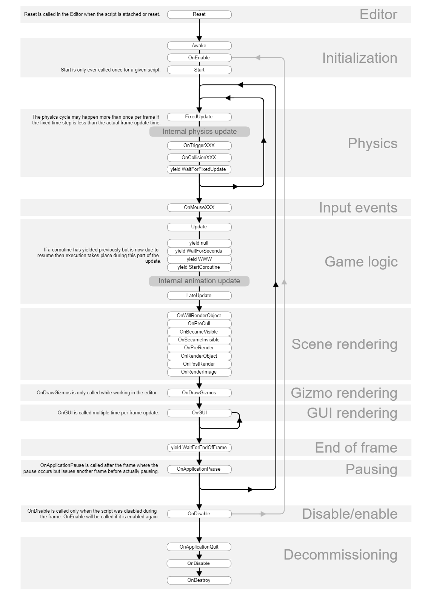

# 20240905 Unity / Game Server

## 게임 서버의 종류 및 동작 방식의 이해

### 게임 서버의 종류와 이해

게임 서버는 실시간 상호 작용 여부에 따라 분류됨

- 비동기적 게임 서버 : WAS와 같은 Stateless, 단방향 통신으로 구성
- 동기적 게임 서버 : Socket과 같은 Statefull, 양방향 통신으로 구성
  - 클라이언트 행동 요청 후 모든 클라이언트들의 동기화 필수(BroadCast)

### 소켓 프로그래밍의 이해

Socket : 클라이언트의 소켓 연결 요청 - 서버의 소켓 연결 수락이 이뤄지면 양방향 데이터 전송을 가능하도록 하는 클라이언트와 서버 간의 접속점

- 패킷 단위 통신
- 서버가 클라이언트의 연결 상태를 저장하는 Stateful Protocol
- 데이터를 주고받을 때 DB가 필수적이지 않음

### 간략한 PVP 동작 예시

Client 자료구조

- PlayerInfo = {
  Index,
  HP,
  Power,
  State,
  Socket
  }

PvP 서버 자료구조

- PlayerInfos = [
  PlayerInfo1,
  PlayerInfo2,
  ...
  ]

- 플레이어 매칭을 위한 대기 큐
- 게임 방 관리를 위한 맵

### 생성형 AI 이용 게임 세계의 시뮬레이션

- chatGPT를 이용해 NPC끼리 상호작용을 시켜 생산적인 활동을 직접 찾아서 하도록 할 수 있음

### [이벤트 함수 실행 순서](https://docs.unity3d.com/kr/530/Manual/ExecutionOrder.html)

- 실행 순서대로 작성됨

#### 1. 에디터

Reset : 오브젝트에 처음 연결 시 / Reset 커맨드 사용 시 스크립트 프로퍼티 초기화

#### 2. 첫 번째 씬 로드

Awake: 프리팹이 인스턴스화 된 직후 호출로 오브젝트가 활성화되기 전까진 호출되지 않음

OnEnable : 오브젝트가 활성화 된 직후에만 호출됨

OnLevelWasLoaded : 새 레벨이 로드된 경우 실행

#### 3. 첫 프레임 업데이트 전

Start : 스크립트 인스턴스가 활성화되었을 때 첫 프레임 업데이트 전 호출

#### 4. 프레임 사이

OnApplicationPause : 일시정지가 감지된 프레임의 끝(일반적으로 프레임 업데이트 사이)에 호출

#### 5. 업데이트

FixedUpdate : 프레임 속도와 관계없이 타이머에서 호출

Update : 프레임에서 한 번 호출

LateUpdate : 프레임에서 한 번, Update가 종료된 후 호출

#### 6. 렌더링

OnPreCull : 카메라가 씬을 컬링하기 전 호출

OnBecameVisible / OnBecameInvisible : 오브젝트가 카메라에 표시 / 표시되지 않을 때 호출

OnWillRenderObject : 오브젝트가 표시될 때 카메라에 한 번 호출

OnPreRender : 카메라가 씬 렌더링을 시작하기 전에 호출

OnRenderObject : 모든 일반 씬 렌더링이 처리된 후 호출되며, 커스텀 지오메트리를 그리는 데 GL 또는 Graphics.DrawMeshNow 사용 가능

OnPostRender : 카메라가 씬 렌더링을 마친 후 호출

OnRenderImage : 씬 렌더링이 끝난 후 이미지 후처리에 사용됨([ImageEffects](https://docs.unity3d.com/kr/530/Manual/comp-ImageEffects.html))

OnGUI : GUI 이벤트에 따라 프레임 당 여러번 호출 호출됨

- 레이아웃 리페인트 이벤트 우선 처리
- 이후 레이아웃 키보드/마우스 이벤트 처리

OnDrawGizmos : 시각화 목적으로 씬 뷰에 기즈모를 그릴 떄 사용(뭔소리임)

#### 7. 코루틴

일반적인 코루틴 업데이트는 Update 함수 반환 뒤 실행

yield : 모든 업데이트 함수가 다음 프레임에 호출된 뒤 계속됨

#### 8. 오브젝트 파괴

OnDestroy : 모든 프레임 업데이트를 마친 후 호출

#### 9. 종료 시

OnApplicationQuit : 어플리케이션 종료 전 모든 게임 오브젝트에 호출

OnDisable : 동작이 비활성화되거나 비활성 상태일 때 호출

#### 스크립트 수명 주기 플로우차트

### Unity ForceMode

ForceMode : Rigidbody.AddForce 를 적용하는 방법에 관한 변수
[ForceMode](https://docs.unity3d.com/kr/530/ScriptReference/ForceMode.html)
