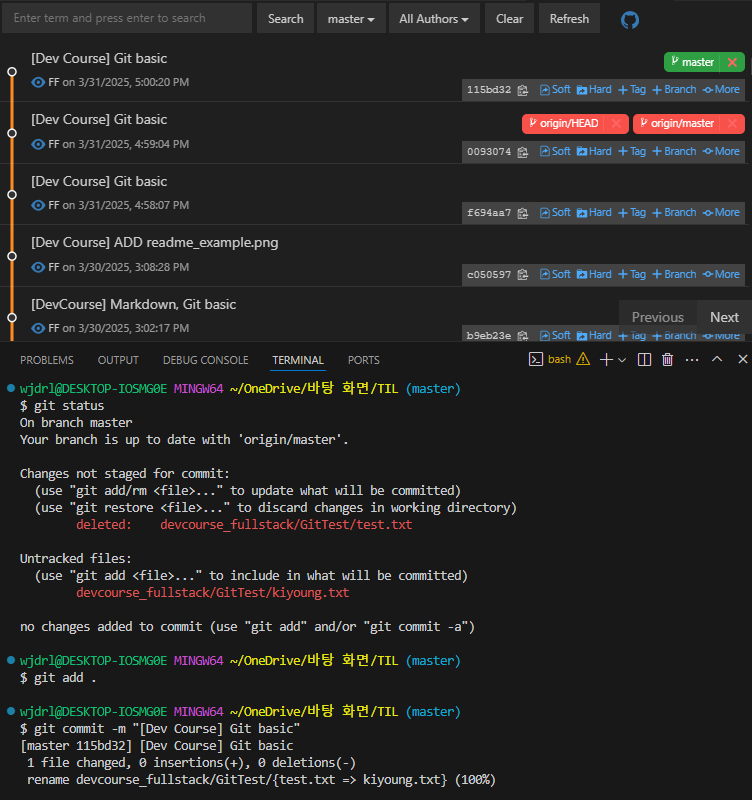

# 풀스택 데브코스 2일차 정리

## Git Basic

Git은 **분산 버전 관리 시스템(DVCS)**으로, 각 사용자의 로컬에서도 독립적으로 버전 관리를 할 수 있는 도구입니다.

---

### CLI vs GUI

- **CLI (Command Line Interface)**  
  터미널 또는 명령어 창에서 **텍스트 기반 명령어**를 입력하여 사용하는 방식입니다.  
  예: `bash`, `CMD`, `PowerShell`, `Windows Terminal` 등

- **GUI (Graphical User Interface)**  
  버튼, 아이콘 등 **시각적 인터페이스**를 통해 Git 명령을 사용할 수 있는 방식입니다.  
  예: VSCode의 Git 패널, GitHub Desktop 등

> VSCode를 이용하면 CLI 없이도 대부분의 Git 작업을 GUI로 수행할 수 있습니다.

---

### 기본 명령어 요약

- `ls` : 현재 디렉토리 목록 보기
- `mkdir` : 새 폴더 만들기
- `touch` : 새 파일 만들기

- `git init` : 로컬 저장소 초기화
- `git status` : 변경사항 확인
- `git add` : 변경 파일을 스테이지에 올림
- `git commit` : 커밋(버전) 생성
- `git log` : 커밋 기록 확인
- `git remote -v` : 연결된 원격 저장소 확인
- `Git History` : VSCode 확장으로 시각적 로그 확인 가능

### 실습 이미지

