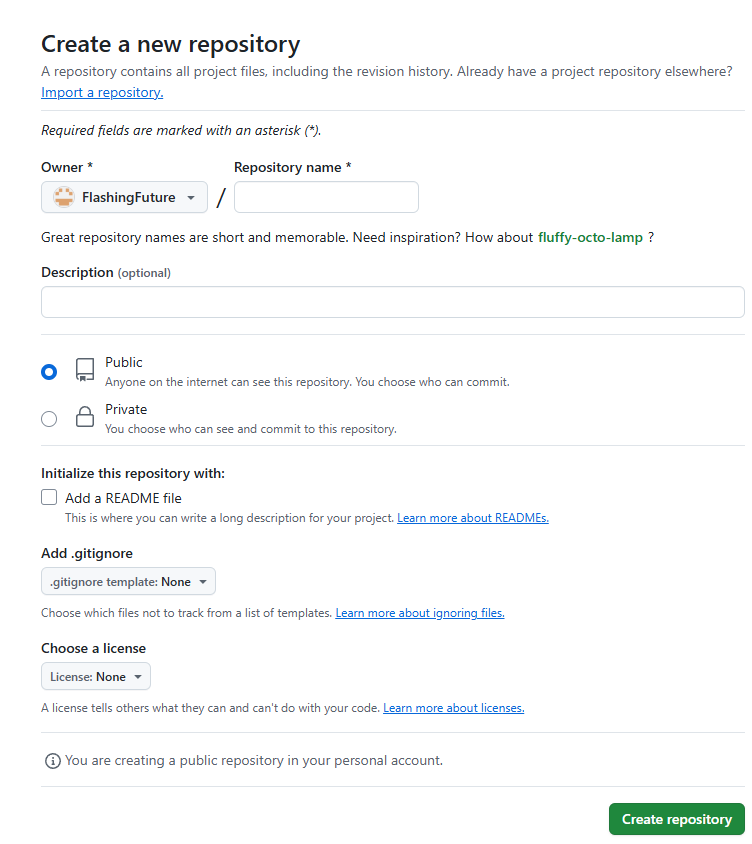
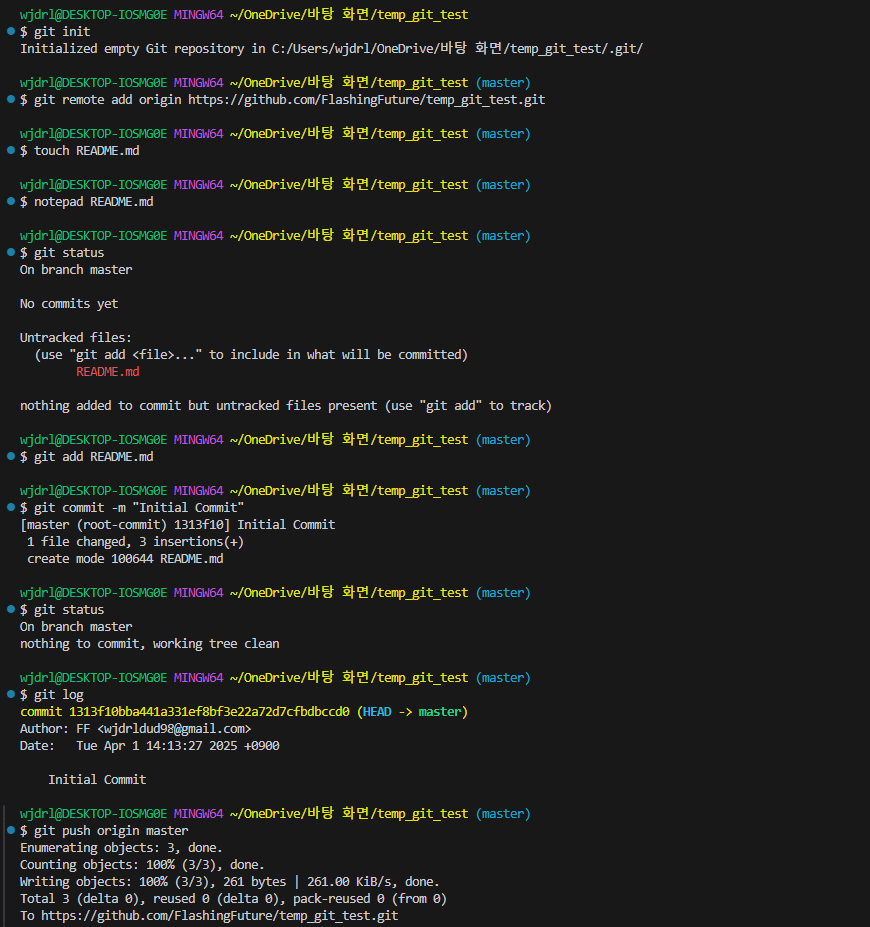

# 풀스택 데브코스 3일차 정리

[Git Documentation](https://git-scm.com/doc)

## GitHub

[GitHub](https://github.com/)

- 깃허브 레포지토리 create



- Public 프로젝트의 경우 모든 사용자가 접근할 수 있고, Private 프로젝트는 인가된 사용자만이 접근할 수 있음

## 깃허브에 로컬 프로젝트 업로드하기

1. 프로젝트 생성
2. remote를 통해 지정 및 변경사항 커밋 후 업로드



## CLI clone

```bash
$ git clone https://github.com/FlashingFuture/temp_git_test.git
```

원격 저장소에 있는 코드를 로컬로 복제

## git remote 제거

```bash
$ git remote remove origin
```

기존에 연결된 원격 저장소(origin)를 제거

## GUI clone

- GitHub Desktop 또는 기타 GUI 툴에서 URL을 입력해 clone 가능
- 로컬 디렉토리 지정 후 clone

GUI를 통해 git을 사용하는 방법. CLI보다 직관적인 장점이 있음

## pull (원격 저장소의 변경 사항 받아오기)

```bash
$ git pull origin master
```

원격 저장소(master 브랜치)의 최신 변경사항을 로컬로 가져옴

## branching (브랜치 생성 및 이동)

```bash
$ git branch feature/new_doc   # 브랜치 생성
$ git checkout feature/new_doc # 해당 브랜치로 이동
```

새로운 기능 개발이나 실험용 작업을 위한 브랜치 생성 및 이동

또는 한 줄 명령어:

```bash
$ git checkout -b feature/new_doc
```

위 두 줄을 한 번에 실행하는 단축 명령어

브랜치 목록 확인:

```bash
$ git branch
```

현재 존재하는 브랜치 목록 확인

브랜치 삭제:

```bash
$ git branch -d feature/login
```

더 이상 필요 없는 브랜치 삭제 (병합된 경우만 삭제 가능)
