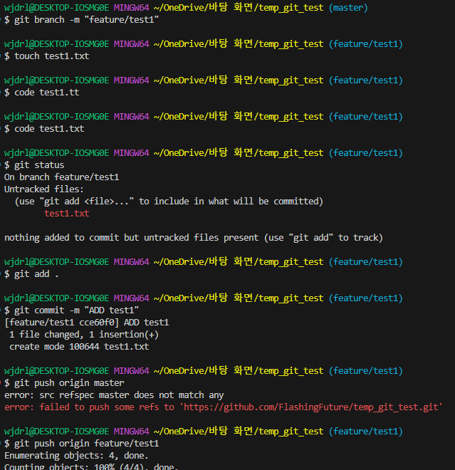
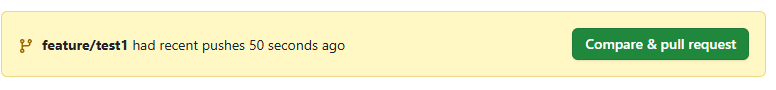

# 웹 풀스택 데브코스 4일차

[git branch docs](https://git-scm.com/book/ko/v2/Git-%EB%B8%8C%EB%9E%9C%EC%B9%98-%EB%B8%8C%EB%9E%9C%EC%B9%98%EB%9E%80-%EB%AC%B4%EC%97%87%EC%9D%B8%EA%B0%80)

## 깃 브랜치 이름 규칙

- 실제 사용 버전: main, master 등
- 기능 개발: feature/{기능명} 등
- 출시 준비: release-{버전명} 등
- 긴급 수정: hotfix/{문제사항} 등

- 브랜치 생성 후 커밋까지 적용해야 실제 브랜치가 적용됨

## Git 브랜치 관련 명령어 정리

### 브랜치 생성

```bash
$ git branch 브랜치이름
```

예:

```bash
$ git branch feature/login
```

### 브랜치 생성과 동시에 이동

```bash
$ git checkout -b 브랜치이름
```

예:

```bash
$ git checkout -b feature/login
```

### 브랜치 목록 확인

```bash
$ git branch
```

### 다른 브랜치로 이동

```bash
$ git checkout 브랜치이름
```

예:

```bash
$ git checkout main
```

### 병합 (merge)

```bash
$ git merge 브랜치이름
```

현재 브랜치에 지정한 브랜치의 내용을 병합  
예:

```bash
$ git merge feature/login
```

### 브랜치 삭제

```bash
$ git branch -d 브랜치이름  # 병합된 브랜치만 삭제 가능
$ git branch -D 브랜치이름  # 강제 삭제
```

예:

```bash
$ git branch -d feature/login
```

### 원격 브랜치 목록 보기

```bash
$ git branch -r
```

### 로컬 + 원격 브랜치 목록 보기

```bash
$ git branch -a
```

### 원격 브랜치 추적 설정

```bash
$ git push -u origin 브랜치이름
```

예:

```bash
$ git push -u origin feature/login
```

### 브랜치 이름 변경

```bash
$ git branch -m 새이름
```

현재 브랜치 이름 변경

예:

```bash
$ git branch -m main
```

## 깃 브랜치 전략

깃 브랜치 전략(깃 플로우): 깃 브랜치를 활용해 변경 이력을 관리하는 전략

### fast-forward 전략

fast-forward: 새로 브랜치를 생성한 시점에서 해당 브랜치에서 구현을 완료하여 분기된 브랜치에 병합하기 전까지, 기존 브랜치에서는 아무런 추가 구현을 하지 않는 방법

### 3-way 전략

3-way: 브랜치 생성 후 각 브랜치에서 추가 작업을 진행한 후, 각 브랜치의 변경 사항을 비교하고 정리하여 합치는 전략

- 일반적으로 가장 많이 사용되는 기본 전략

## Pull Request & Merge (깃허브)





- 기능 브랜치에서 작업을 완료하면 GitHub에서 **Pull Request(PR)** 생성
- 코드 리뷰 및 승인 과정을 거쳐 `main` 등의 브랜치로 병합
- 병합 방식 선택 가능: Merge commit / Squash / Rebase 등

## GitHub에서 병합된 브랜치 동기화 (로컬 업데이트)

```bash
$ git checkout main
$ git pull origin main
```

- 로컬에서 최신 병합 결과를 반영

## 충돌(Conflict) 해결

- 병합 중 충돌 발생 시, Git이 자동 병합하지 못한 부분을 표시
- 충돌 파일을 직접 수정한 후, 아래 명령으로 병합 완료

```bash
$ git add 충돌수정한파일
$ git commit
```

- 이후 병합 완료됨. 필요 시 `git status`로 확인
