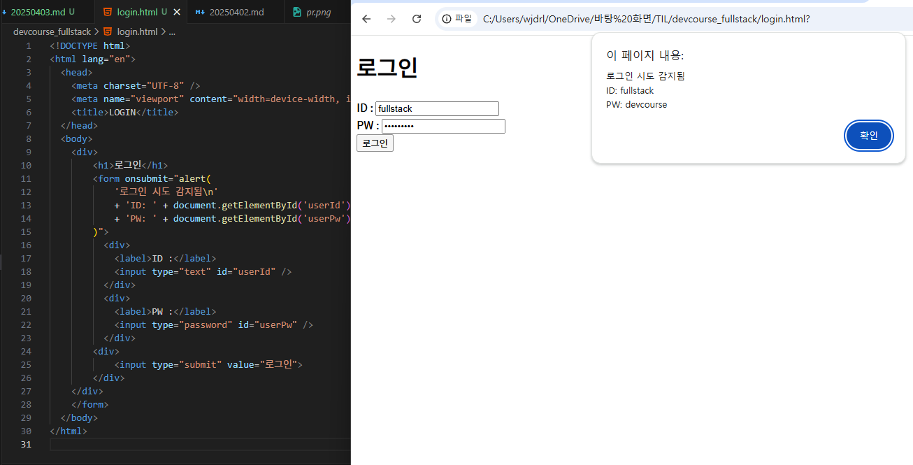

# 웹 풀스택 데브코스 5일차

## 웹의 이해

인터넷: 전 세계 모든 컴퓨터를 하나의 통신망 안에서 연결한다는 의미를 지닌 International Network의 약자

웹: 인터넷에 연결된 컴퓨터를 통해 사람들이 정보를 공유할 수 있는 공간

- World Wide Web을 줄여 WWW로 부름

웹 브라우저: 웹 페이지에 접근하고 인터넷을 탐색하기 위한 애플리케이션

### 웹의 구조

- 클라이언트: 서비스를 이용하는(요청하는) 컴퓨터

- 서버: 서비스를 제공하는 컴퓨터

- 클라이언트와 서버의 연결은 웹 프로토콜인 HTTP(HyperText Transfer Protocol)을 사용하여 이루어짐

### 웹 개발 직무 이해

[프론트엔드와 백엔드](https://ko.wikipedia.org/wiki/%ED%94%84%EB%A1%A0%ED%8A%B8%EC%97%94%EB%93%9C%EC%99%80_%EB%B0%B1%EC%97%94%EB%93%9C)

- 프론트엔드는 사용자와의 상호작용을, 백엔드는 사용자에게 드러나지 않는 로직과 기능을 담당

### HTML

HyperText Markup Language: 웹 페이지의 구조를 명시하는 언어이자 웹 페이지를 연결하는 기능을 가진 텍스트

#### <>

<>(Tag)에 감싸진 글자가 그 태그의 역할을 맡음

```html
<tag>감싸인 글자가 그 태그의 역할을 맡음</tag>
```

### 실습 이미지지



[코드 링크](login.html)
